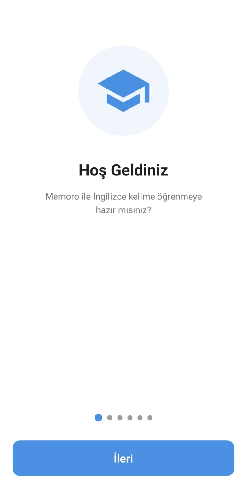
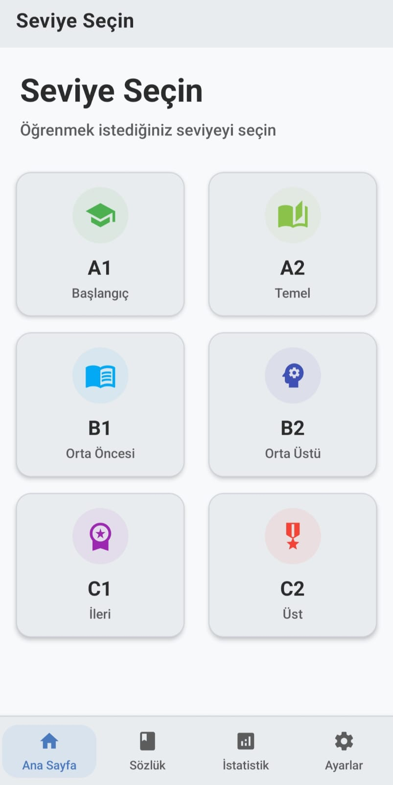
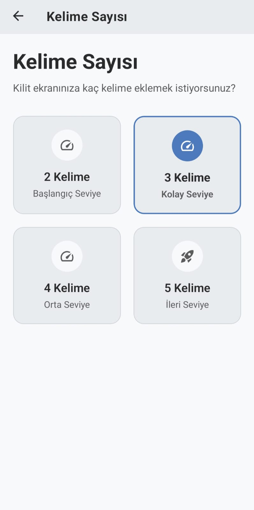
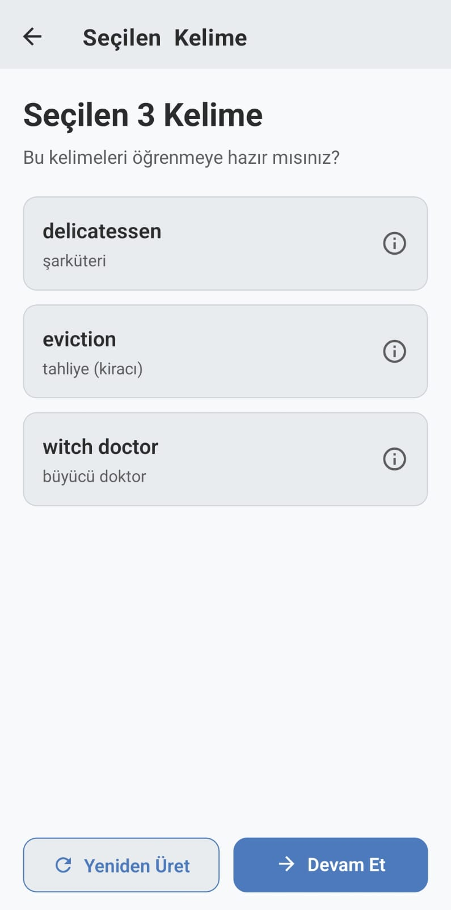
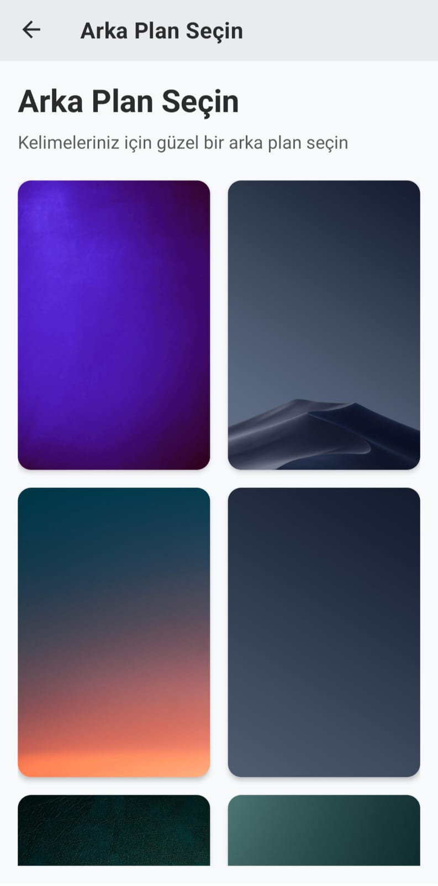
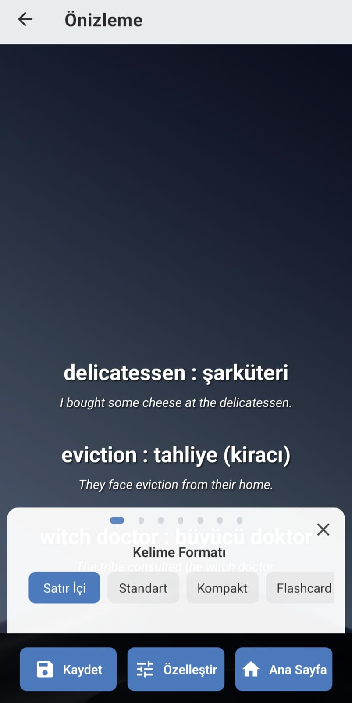
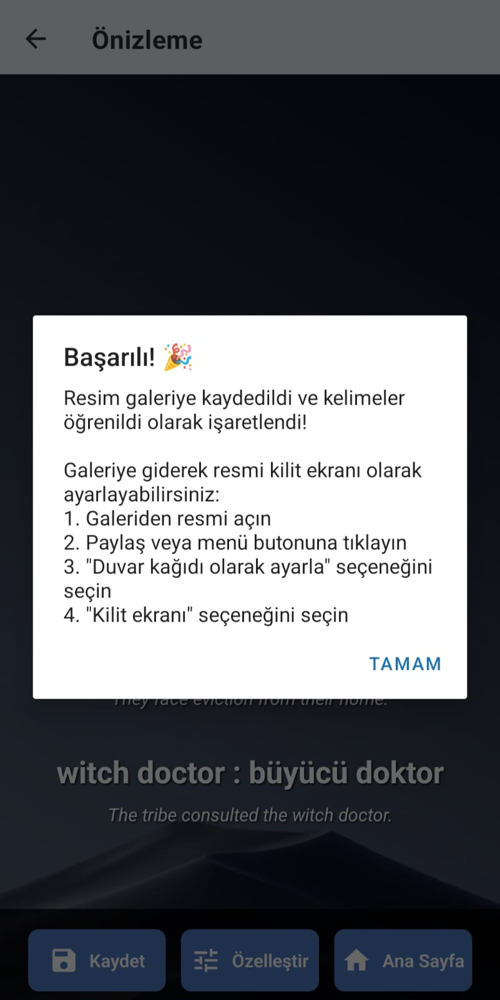
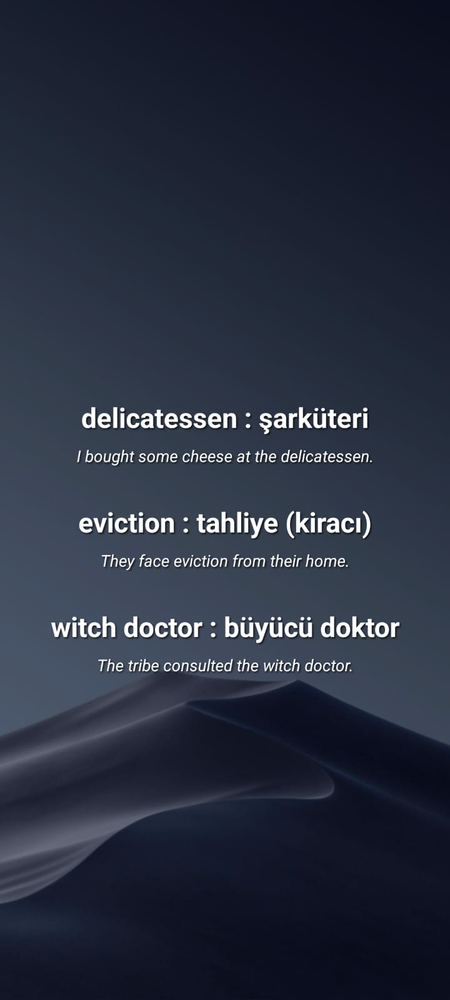
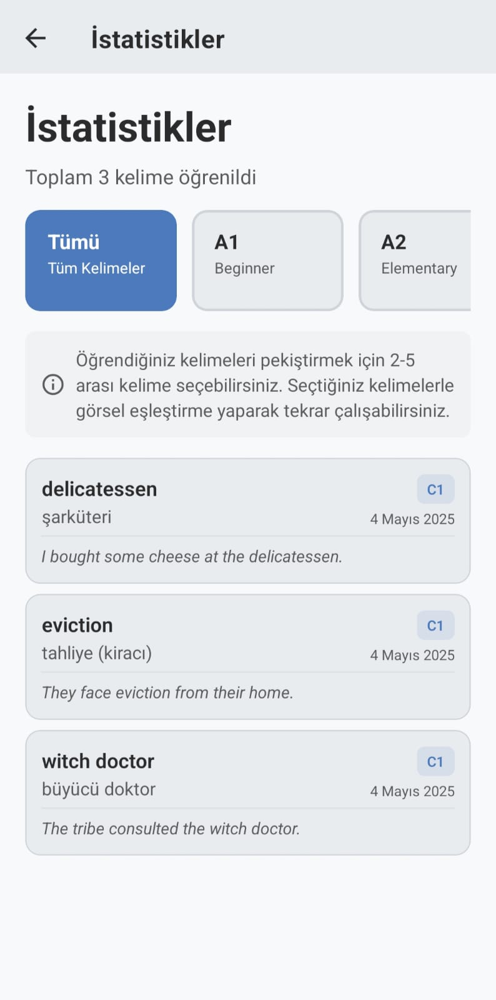
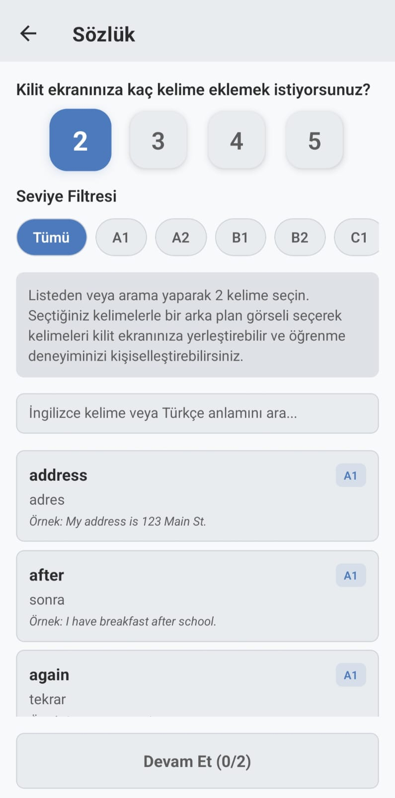

# Memoro - İngilizce Kelime Öğrenme Uygulaması

Memoro, İngilizce kelime dağarcığınızı geliştirmek için tasarlanmış mobil bir uygulamadır. Uygulama, seviyenize uygun kelimeleri günlük olarak sunar ve bu kelimelerle özel kilit ekranı görüntüleri oluşturarak telefonunuzu her açtığınızda pasif öğrenme sağlar.

## 📱 Özellikler

- **Seviye Seçimi**: A1'den C2'ye kadar farklı zorluk seviyelerinde kelimeler
- **Geniş Kelime Havuzu**: 44.000'den fazla kelime içeren kapsamlı sözlük
- **Kişiselleştirme**: Günlük 2-5 arası kelime seçimi
- **Çevrimdışı Kullanım**: İnternete ihtiyaç duymadan tamamen çevrimdışı çalışabilme
- **Sözlük Fonksiyonu**: Seviyeye göre kelime arama ve öğrenme imkanı
- **Görsel Oluşturma**: Seçilen kelimelerle kilit ekranı görselleri oluşturma
- **Galeri Entegrasyonu**: Oluşturulan görselleri doğrudan galeriye kaydetme
- **İlerleme Takibi**: Öğrenilen kelimelerin seviyeye göre istatistiklerini görüntüleme
- **Çoklu Tema Desteği**: Açık, karanlık ve pastel tema seçenekleri
- **Hatırlatıcılar**: Günlük bildirimlerle öğrenme rutininizi sürdürme
- **Çoklu Dil Desteği**: Farklı dil seçenekleriyle kullanım kolaylığı

## 🚀 Teknolojiler

- React Native
- Expo
- TypeScript
- i18next (çoklu dil desteği)
- AsyncStorage
- React Navigation
- Expo Notifications
- Expo SQLite

## 🛠️ Kurulum

1. Repo'yu klonlayın:
   ```
   git clone https://github.com/username/memoro.git
   cd memoro
   ```

2. Bağımlılıkları yükleyin:
   ```
   npm install
   ```

3. Uygulamayı çalıştırın:
   ```
   npm start
   ```

## 📂 Proje Yapısı

```
/app
  /components - UI bileşenleri
  /contexts - React context yönetimi
  /data - Kelime listeleri ve veritabanı işlemleri
  /screens - Uygulama ekranları
  /services - Bildirim, veri yönetimi servisleri
  /theme - Tema ve stil tanımlamaları 
  /utils - Yardımcı fonksiyonlar
/assets - Görsel ve font dosyaları
```

## 🖼️ Projeden Görseller

| Ekran Görüntüsü 1 | Ekran Görüntüsü 2 | Ekran Görüntüsü 3 |
|---|---|---|
|  |  |  |
|  |  |  |
|  |  |  |
|  |  |  |

## 🔜 Gelecek Özellikler

- Farklı dil seçenekleri (Portekizce, İspanyolca vb.)
- Kelime öğrenme oyunları

