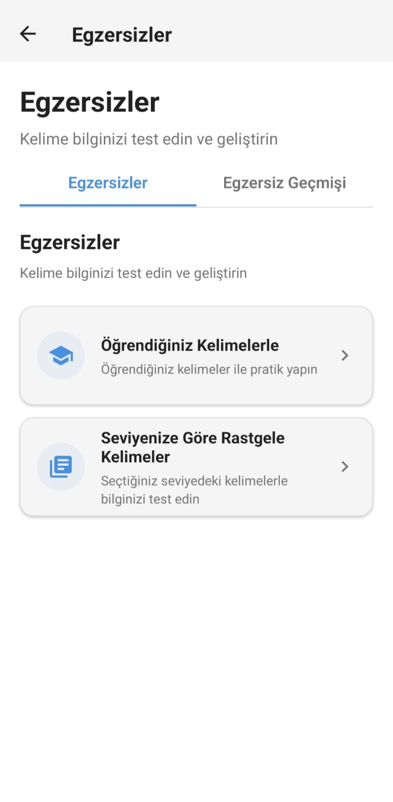
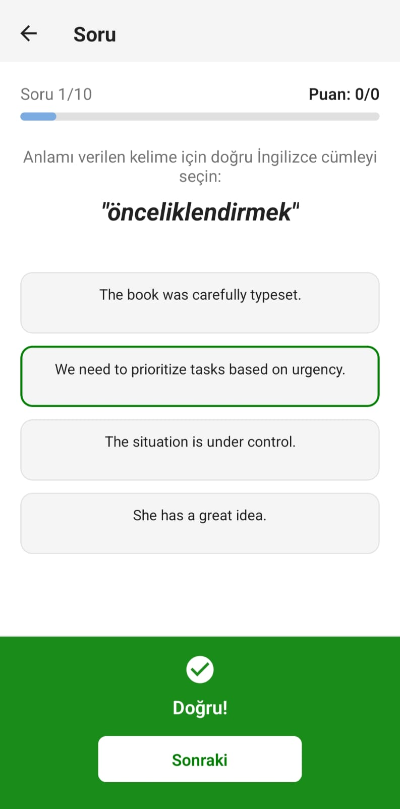
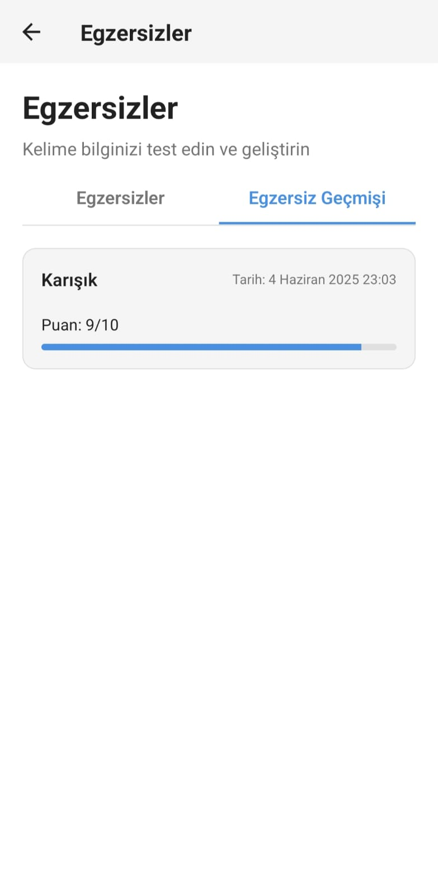

# Memoro - İngilizce Kelime Öğrenme Uygulaması

Memoro, İngilizce kelime dağarcığınızı geliştirmek için tasarlanmış mobil bir uygulamadır. Uygulama, seviyenize uygun kelimeleri günlük olarak sunar ve bu kelimelerle özel kilit ekranı görüntüleri oluşturarak telefonunuzu her açtığınızda pasif öğrenme sağlar.

## 📥 İndirme

APK dosyasını [GitHub Releases](https://github.com/eyupduran/memoro/releases/tag/v1.0.0) sayfasından indirebilirsiniz.

## 📱 Özellikler

### 🎯 Temel Özellikler
- **Seviye Seçimi**: A1'den C2'ye kadar farklı zorluk seviyelerinde kelimeler
- **Geniş Kelime Havuzu**: 44.000'den fazla kelime içeren kapsamlı sözlük
- **Kişiselleştirme**: Günlük 2-5 arası kelime seçimi
- **Çevrimdışı Kullanım**: İnternete ihtiyaç duymadan tamamen çevrimdışı çalışabilme
- **Sözlük Fonksiyonu**: Seviyeye göre kelime arama ve öğrenme imkanı
- **Kelime Listeleri**: Öğrenilecek veya öğrenilen kelimeleri özel listeler halinde organize etme
- **Kelime Listesi Egzersizleri**: Oluşturulan kelime listeleriyle özel egzersizler yapabilme
- **Görsel Oluşturma**: Seçilen kelimelerle kilit ekranı görselleri oluşturma
- **Galeri Entegrasyonu**: Oluşturulan görselleri doğrudan galeriye kaydetme
- **İlerleme Takibi**: Öğrenilen kelimelerin seviyeye göre istatistiklerini görüntüleme
- **Çoklu Tema Desteği**: Açık, karanlık ve pastel tema seçenekleri
- **Hatırlatıcılar**: Günlük bildirimlerle öğrenme rutininizi sürdürme
- **Çoklu Dil Desteği**: Türkçe ve Portekizce dil seçenekleriyle kullanım kolaylığı

### 🎮 Egzersiz ve Oyun Özellikleri
- **Çoklu Egzersiz Türleri**: Boşluk doldurma, kelime eşleştirme, cümle eşleştirme ve karışık egzersizler
- **Egzersiz Geçmişi**: Tamamlanan egzersizlerin detaylı geçmişi ve sonuçları
- **Yarım Kalan Egzersizler**: Devam edilebilen yarım kalan egzersizler
- **Puanlama Sistemi**: Egzersiz sonuçlarında detaylı puanlama ve istatistikler
- **Oyun Entegrasyonu**: WebView tabanlı İngilizce öğrenme oyunları
- **Ses Efektleri**: Egzersiz sırasında tıklama ve doğru/yanlış ses efektleri

### 📚 Gramer ve Eğitim
- **Gramer Bölümü**: Seviyeye göre gramer konuları ve alıştırmaları
- **WebView Gramer**: İnteraktif gramer öğrenme sayfaları
- **Gramer Seviye Seçimi**: A1-C2 seviyelerinde gramer konuları
- **Sözlük Entegrasyonu**: Gramer sayfasından doğrudan sözlük erişimi

### 📊 İstatistik ve Analiz
- **Detaylı İstatistikler**: Öğrenilen kelimelerin seviye bazında analizi
- **Kelime Sayısı Takibi**: Toplam öğrenilen kelime sayısı
- **Seviye Bazlı Filtreleme**: Kelimeleri seviyeye göre filtreleme
- **Arama Fonksiyonu**: Öğrenilen kelimelerde arama yapabilme
- **Kelime Silme**: Öğrenilen kelimeleri silme özelliği
- **Kelime Pekiştirme**: Öğrenilen kelimeleri tekrar çalışma

### 🎨 Görsel Özelleştirme
- **10 Farklı Görsel Formatı**: Standart, inline, compact, flashcard, dictionary, quiz, poetic, bubble, memo, modern
- **Gelişmiş Özelleştirme**: Font boyutu, pozisyon, renk ayarları
- **Arka Plan Seçimi**: Çeşitli arka plan görselleri
- **Görsel Önizleme**: Gerçek zamanlı görsel önizleme
- **Galeri Kaydetme**: Oluşturulan görselleri galeriye kaydetme
- **Paylaşım**: Görselleri sosyal medyada paylaşma

### 🔧 Gelişmiş Ayarlar
- **Veri Yedekleme**: Kelime listelerini ve ayarları dışa aktarma
- **Veri Geri Yükleme**: Yedeklenen verileri içe aktarma
- **Dil Değiştirme**: Uygulama dilini değiştirme (Türkçe/Portekizce)
- **Tema Değiştirme**: Açık, karanlık ve pastel tema seçenekleri
- **Bildirim Ayarları**: Günlük hatırlatıcı bildirimleri
- **Veri Yönetimi**: Kelime verilerini yeniden yükleme

### 🚀 Teknik Özellikler
- **Onboarding**: İlk kullanım için kapsamlı tanıtım
- **Veri Yükleme**: İlk kurulumda kelime ve görsel verilerini otomatik yükleme
- **Pagination**: Büyük veri setlerinde sayfalama desteği
- **Offline Database**: SQLite tabanlı yerel veritabanı
- **AsyncStorage**: Ayarlar ve kullanıcı tercihleri için yerel depolama
- **Responsive Design**: Farklı ekran boyutlarına uyumlu tasarım

## 🚀 Teknolojiler

- **React Native**: Cross-platform mobil uygulama geliştirme
- **Expo**: Geliştirme ve dağıtım platformu
- **TypeScript**: Tip güvenli JavaScript
- **i18next**: Çoklu dil desteği (Türkçe, Portekizce)
- **AsyncStorage**: Yerel veri depolama
- **React Navigation**: Navigasyon yönetimi
- **Expo Notifications**: Bildirim sistemi
- **Expo SQLite**: Yerel veritabanı
- **React Native WebView**: Web içeriği entegrasyonu
- **Expo Media Library**: Galeri entegrasyonu
- **Expo Screen Capture**: Ekran görüntüsü alma
- **React Native View Shot**: Görsel oluşturma
- **Expo AV**: Ses dosyası oynatma
- **Expo Document Picker**: Dosya seçimi
- **Expo File System**: Dosya sistemi işlemleri
- **Expo Sharing**: Paylaşım işlevleri
- **Expo Speech**: Metin-konuşma dönüşümü
- **React Native Reanimated**: Animasyonlar
- **React Native Gesture Handler**: Dokunma hareketleri

## 🛠️ Kurulum

1. Repo'yu klonlayın:
   ```
   git clone https://github.com/username/memoro.git
   cd memoro
   ```

2. Bağımlılıkları yükleyin:
   ```
   npm install
   ```

3. Uygulamayı çalıştırın:
   ```
   npm start
   ```

## 📂 Proje Yapısı

```
/app
  /components - UI bileşenleri
  /contexts - React context yönetimi
  /data - Kelime listeleri ve veritabanı işlemleri
  /screens - Uygulama ekranları
  /services - Bildirim, veri yönetimi servisleri
  /theme - Tema ve stil tanımlamaları 
  /utils - Yardımcı fonksiyonlar
  /locales - Çoklu dil dosyaları (Türkçe, Portekizce)
  /types - TypeScript tip tanımlamaları
/assets - Görsel ve font dosyaları
```

## 🖼️ Projeden Görseller

| Ekran Görüntüsü 1 | Ekran Görüntüsü 2 | Ekran Görüntüsü 3 |
|---|---|---|
|  |  |  |
|  |  |  |
|  |  |  |
|  |  |  |
|  |  |  |
|  | | |

## 🔜 Gelecek Özellikler

- Farklı dil seçenekleri (İspanyolca vb.)
- Daha fazla egzersiz türü


